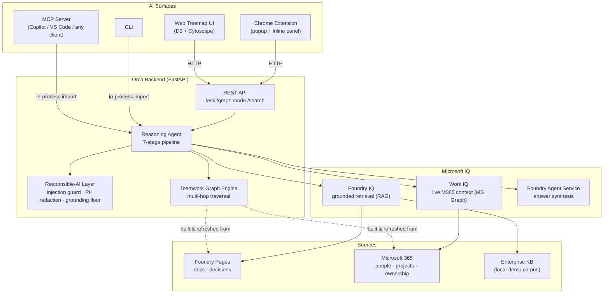
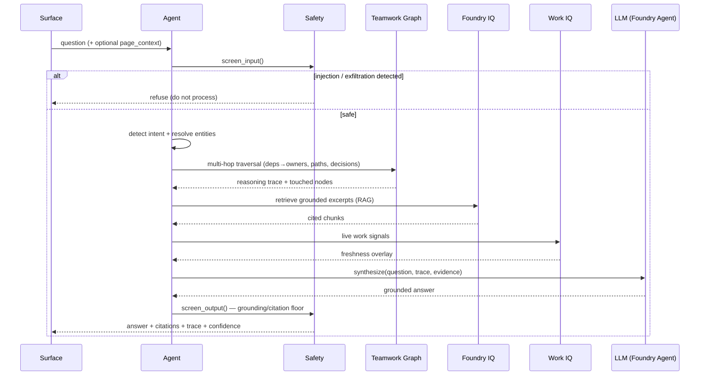

# Orca — Architecture

## System overview

## Request flow for `POST /ask`

## Data model — the Teamwork Graph

**Node kinds:** `person`, `project`, `decision`, `page`, `team`.

**Edge types** (each with forward/reverse natural-language phrasing for trace generation):

| Edge | Meaning |
|---|---|
| `reports_to` | person → manager |
| `member_of` | person → team |
| `teammate` | derived from shared team |
| `owns` | person → project |
| `contributes_to` | person → project |
| `depends_on` | project → project (traversed transitively) |
| `decided_for` | decision → project |
| `made_by` | decision → person |
| `documents` | page → project/decision |

**Multi-hop primitives** (`backend/app/graph.py`): `find_path` (BFS shortest path, direction-aware), `dependencies_of` (transitive), `blockers_for` (deps → owners), `owners_of` / `contributors_of`, `decisions_for`, `pages_for`, `neighbors`, `search`.

## Live vs. local-demo mode

| Layer | Live mode | Local-demo mode (default) |
|---|---|---|
| Graph source | Foundry Pages + Work IQ (MS Graph) | bundled `org_graph.json` |
| Retrieval | Foundry IQ → Azure AI Search (hybrid + semantic rerank) | dependency-free TF-IDF retriever over the bundled KB |
| Synthesis | Foundry Agent Service model | structured deterministic composition |
| Work context | live Microsoft Graph | bundled `work_iq_context.json` |

Mode is chosen automatically from environment (`backend/app/config.py`). The agent, graph, safety, and all surfaces are identical across modes — only the I/O adapters change, so the demo faithfully represents the production path.
